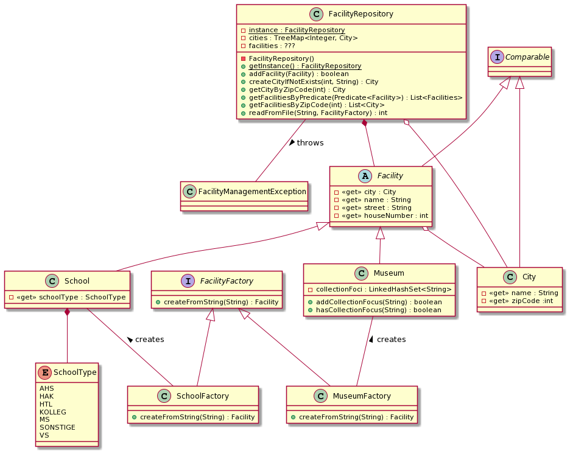

# PROO 3 - Assignment: Facility Management

## Objective
Create a program for managing public facilities.

## Things To Learn
* Working with various collections.
* Gaining a better understanding of the _Factory Pattern_.

## Submission Guidelines
* Via Github Classroom following the assignment acceptance criteria.

## Coding Guidelines
* Package name (of the root package): at.htlleonding.newsagency
* Each source file shall have a file header denoting the application, assignment number, author
* Each class shall have a short API compliant documentation stating its purpose and important things to know.

## Task



For this assignment you'll be creating a program for reading and storing public facilities - in our case museums and schools - and the cities they belong to. The main focus of this assignment is for you to get a better understanding of the _Factory Pattern_, depicted on the bottom of the diagram above: Both facility types not only have their own class (`Museum` and `School`) inheriting from a general `Facility` - they also have their own _factory_ implementing the `FacilityFactory` interface. This allows us to easily extend our program by additional facilities - such as public pools, hospitals and so on.

Aside from the diagram, the supplied _unit tests_ and a minimalistic `Main`-class, the following notes should give you some insights into the inner workings:

* Each `City` is represented by a city name and zip code and implements the `Comparable`-interface using the zip code for ordering. Two cities are equal if they have the same zip code.
* `Facility` is the base class for each facility. Besides the name it contains the exact address (using the `City` class) of the facility.
    * Facilities are ordered by their cities. In the same city they are ordered alphabetically by their street names. In the same street they are ordered by their house number.
    * Facilities are equal if they have the same address.
    * A `Museum` extends the base facility by a set of collection foci and provides two simple methods for checking if a museum is relevant to one's interests.
    * A `School` extends the base facility by its school type using the enum `SchoolType`. Two school objects are equal if they have the same address **and** the same school type - since there can be multiple school types in one building, as you surely know.
* Facilities can be created using their factories `MuseumFactory` and `SchoolFactory`, both implementing the interface `FacilityFactory` providing a method for creating a facility by its String representation - such as the ones in the supplied _comma-separated-value_-files.
    * For this task we want to make sure, that each city is created only once - i.e. cities from multiple facilities should not only be _equal_ but also _identical_. Use the `FacilityRepository` below to check if a city with the same zip code has already been created.
* The `FacilityRepository` poses as the central point for storing and accessing cities and facilities. It is implemented using the _Singleton_-pattern with _lazy initialization_.
    * The cities should be stored in a `TreeMap`, since the zip code is a suitable key and we want the collection to be sorted for easy printing (see section below). You can choose an appropriate collection for storing the facilities yourself.
    * Using the `addFacility`-method it should be possible to add a facility - but only if it has not been added yet. The _boolean_ return value should be used to signal the success of the method.
    * The `createCityIfNotExists`-method accepts a city name and zip code as parameters and either returns the relevant `City` object or creates it, if it doesn't yet exist.
    * `getCityByZipCode` returns the city with the passed zip code. If the city does not exist a `FacilityManagementException` with an appropriate message is thrown.
    * The method `getFacilitiesByZipCode` can be used to return a _sorted_ list of facilities in a certain city, specified by its zip code.
    * The `readFromFile`-method accepts the path to a _comma-separated-value_-file and a `FacilityFactory`-object to be used to parse the lines with.
        * If an exception occurs _while **loading**_ the file (i.e. an `IOException` of some sorts), wrap it inside of a `FacilityManagementException` and rethrow it with an appropriate message.
        * If something happens _while **parsing**_ the rows (i.e. corrupt data or values) catch the exception and continue processing the other lines as if nothing happened. **Count the number of problems** and return it.
    * Override the `toString`-method to create an output like the one seen below.
* We're introducing a new concept in this exercise: `Predicate`s, representing boolean functions with one parameter. We can use them as filters, as demonstrated in the `Main` class. Use the following implementation of the `getFacilitiesByPredicate`-method in the `FacilityRepository` and experiment with own filters in the `Main` class!

```
public List<Facility> getFacilitiesByPredicate(Predicate<Facility> predicate) {
    return this.facilities.stream().filter(predicate).toList();
}
```


### Output Example
```
4010 Linz:
	Francisco Carolinum Linz (Museumstraße 14, 4010 Linz) - Sammlungsschwerpunkte: Kunst
4020 Linz:
	OÖ. Literaturmuseum im StifterHaus (Adalbert-Stifter-Platz 1, 4020 Linz) - Sammlungsschwerpunkte: Literatur, Personen
	Nordico Stadtmuseum Linz (Dametzstraße 23, 4020 Linz) - Sammlungsschwerpunkte: Kunst, Volkskunde, Natur, Geschichte, Zeitgeschichte, Kunstgewerbe, Archäologie, Alltagskultur
	Lentos Kunstmuseum Linz (Ernst-Koref-Promenade 1, 4020 Linz) - Sammlungsschwerpunkte: Kunst
	Zahnmuseum Linz (Pfarrgasse 9, 4020 Linz) - Sammlungsschwerpunkte: Gesundheit
	Schlossmuseum Linz (Schlossberg 1, 4020 Linz) - Sammlungsschwerpunkte: Volkskunde, Natur, Religion, Handwerk, Zeitgeschichte, Industriegeschichte, Militaria, Verkehr, Alltagskultur, Handel, Industrie, Kunst, Technik, Technikgeschichte, Geschichte, Kunstgewerbe, Personen, Naturwissenschaft, Transport, Musik
	Geschichteclub Stahl (Stahlstraße 33, 4020 Linz) - Sammlungsschwerpunkte: Industrie, Technik, Technikgeschichte, Geschichte, Industriegeschichte
	Zeitgeschichte MUSEUM voestalpine (voestalpine-Straße 1, 4020 Linz) - Sammlungsschwerpunkte: Industrie, Geschichte, Zeitgeschichte, Industriegeschichte
	voestalpine Stahlwelt (voestalpine-Straße 4, 4020 Linz) - Sammlungsschwerpunkte: Industrie, Technik, Technikgeschichte, Industriegeschichte
4021 Linz:
	Oö. Landesbibliothek - Schatzkammer (Schillerplatz 2, 4021 Linz) - Sammlungsschwerpunkte: Literatur
4030 Linz/Pichling:
	Zweierschützen Archiv (Schloss Ebelsberg, Schlossweg 7, 4030 Linz/Pichling) - Sammlungsschwerpunkte: Geschichte, Militaria
	Cowboy-Museum Fatsy (Traundorfer Straße 266, 4030 Linz/Pichling) - Sammlungsschwerpunkte: Völkerkunde
4040 Linz:
	Ars Electronica Center (Ars-Electronica-Straße 1, 4040 Linz) - Sammlungsschwerpunkte: Sonstige, Kunst, Technik, Technikgeschichte, Naturwissenschaft
	Biologiezentrum Linz (J.-W.-Klein-Straße 73, 4040 Linz) - Sammlungsschwerpunkte: Natur, Naturwissenschaft
4050 Traun:
	Höhere technische Bundeslehranstalt für Informations- und Kommunikationstechnologie und Bundesfachschule für Informationstechnik (Bahnhofstraße 52, 4050 Traun) - HTL
	Volksschule Traun (Linzerstraße 7, 4050 Traun) - VS
	Museum im Steinhumergut (Neubauerstraße 75, 4050 Traun) - Sammlungsschwerpunkte: Industrie, Landwirtschaft, Volkskunde, Handwerk, Geschichte, Gewerbe, Industriegeschichte, Alltagskultur
	Schloss Traun (Schlossstraße 8, 4050 Traun) - Sammlungsschwerpunkte: Volkskunde, Geschichte, Personen, Archäologie, Alltagskultur
	Integratives Schulzentrum Traun (Schulstraße 11, 4050 Traun) - SONSTIGE
	Musikmittelschule Traun (Schulstraße 11, 4050 Traun) - MS
	Bundesrealgymnasium Traun (Schulstraße 59, 4050 Traun) - AHS
	Bundeshandelsakademie und Bundeshandelsschule Traun (Schulstraße 59, 4050 Traun) - HAK
	Volksschule Oedt (Traunerstraße 80, 4050 Traun) - VS
	Mittelschule St. Martin (Untere Dorfstraße 145, 4050 Traun) - MS
	Polytechnische Schule Traun (Untere Dorfstraße 145, 4050 Traun) - SONSTIGE
	Volksschule Traun-St. Martin (Untere Dorfstraße 147, 4050 Traun) - VS
	Volksschule St. Dionysen (Weidfeldstraße 104, 4050 Traun) - VS
4052 Ansfelden:
	Volksschule Ansfelden (Anton Brucknerstraße 10, 4052 Ansfelden) - VS
	Anton-Bruckner-Museum (Augustinerstraße 3, 4052 Ansfelden) - Sammlungsschwerpunkte: Personen, Musik
	Anton Bruckner Neue Mittelschule Ansfelden (Haiderstraße 8, 4052 Ansfelden) - MS
4053 Haid:
	Sportmittelschule 2 Haid (Dr.-Adolf-Schärf-Straße 23, 4053 Haid) - MS
	Landwirtschaftliche Berufs- und Fachschule Ritzlhof (Kremstalstraße 125, 4053 Haid) - SONSTIGE
	Volksschule Haid (Schulstraße 5, 4053 Haid) - VS
	Mittelschule 1 Haid (Schulstraße 5, 4053 Haid) - MS
	Volksschule Kremsdorf (Volksheimstraße 11, 4053 Haid) - VS
4055 Pucking:
	Volksschule Pucking (Puckinger Straße 8, 4055 Pucking) - VS
4060 Leonding:
	Volksschule Leonding (Alhartinger Weg 8, 4060 Leonding) - VS
	TURM 9 - Stadtmuseum Leonding (Daffingerstraße 55, 4060 Leonding) - Sammlungsschwerpunkte: Handel, Landwirtschaft, Volkskunde, Natur, Handwerk, Geschichte, Gewerbe, Zeitgeschichte, Militaria, Archäologie, Alltagskultur
	Volksschule Doppl (Haidfeldstraße 29, 4060 Leonding) - VS
	Mittelschule Doppl (Haidfeldstraße 31, 4060 Leonding) - MS
	Volksschule Haag (Herderstraße 36, 4060 Leonding) - VS
	Mittelschule Hart (Limesstraße 2, 4060 Leonding) - MS
	Volksschule Hart (Limesstraße 4, 4060 Leonding) - VS
	Allgem. Sonderschule Hart (Limesstraße 6, 4060 Leonding) - SONSTIGE
	Höhere Technische Bundeslehranstalt Leonding (Limesstraße 12, 4060 Leonding) - SONSTIGE
	Kolleg für EDV/Organisation (Limesstraße 12, 4060 Leonding) - KOLLEG
	Höhere Technische Bundeslehranstalt Leonding (Limesstraße 12, 4060 Leonding) - HTL
	Musikmittelschule Leonding (Ruflingerstraße 14, 4060 Leonding) - MS
	Allgem. Landessonderschule 1 für lernschwache und leistungsbehinderte Kinder im Kinderdorf St. Isidor (St. Isidor 1, 4060 Leonding) - SONSTIGE
	Landesschulzentrum für Bewegung und Sprache St. Isidor (St. Isidor 17, 4060 Leonding) - SONSTIGE
```
[...]
```
-------------------------
All museums with religious foci:
Schlossmuseum Linz (Schlossberg 1, 4020 Linz) - Sammlungsschwerpunkte: Volkskunde, Natur, Religion, Handwerk, Zeitgeschichte, Industriegeschichte, Militaria, Verkehr, Alltagskultur, Handel, Industrie, Kunst, Technik, Technikgeschichte, Geschichte, Kunstgewerbe, Personen, Naturwissenschaft, Transport, Musik
Stiftsmuseum Wilhering (Linzer Straße 4, 4073 Wilhering) - Sammlungsschwerpunkte: Kunst, Religion, Geschichte, Musik
Basilika Enns-St. Laurenz (Lauriacumstraße 4, 4470 Enns) - Sammlungsschwerpunkte: Religion, Geschichte, Personen, Archäologie
-------------------------
All elementary schools between Traun and Haid:
Volksschule Traun (Linzerstraße 7, 4050 Traun) - VS
Volksschule Oedt (Traunerstraße 80, 4050 Traun) - VS
Volksschule Traun-St. Martin (Untere Dorfstraße 147, 4050 Traun) - VS
Volksschule St. Dionysen (Weidfeldstraße 104, 4050 Traun) - VS
Volksschule Ansfelden (Anton Brucknerstraße 10, 4052 Ansfelden) - VS
Volksschule Kremsdorf (Volksheimstraße 11, 4053 Haid) - VS
```
